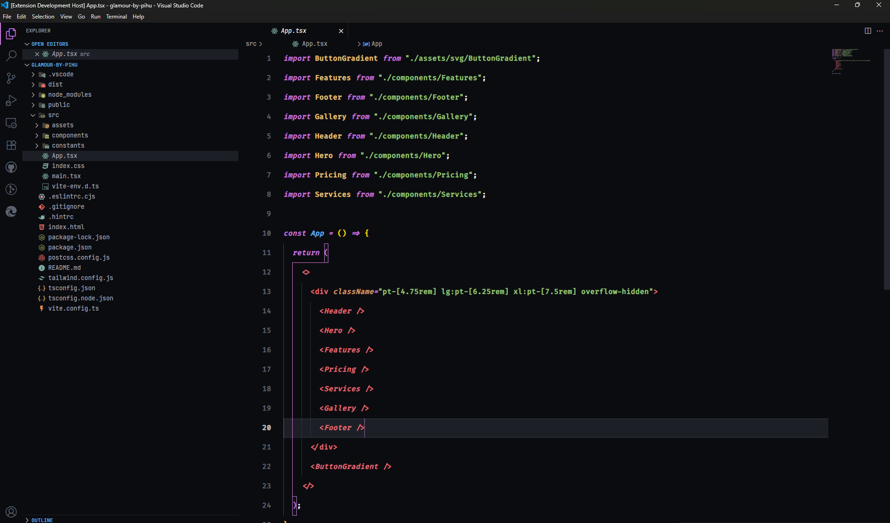
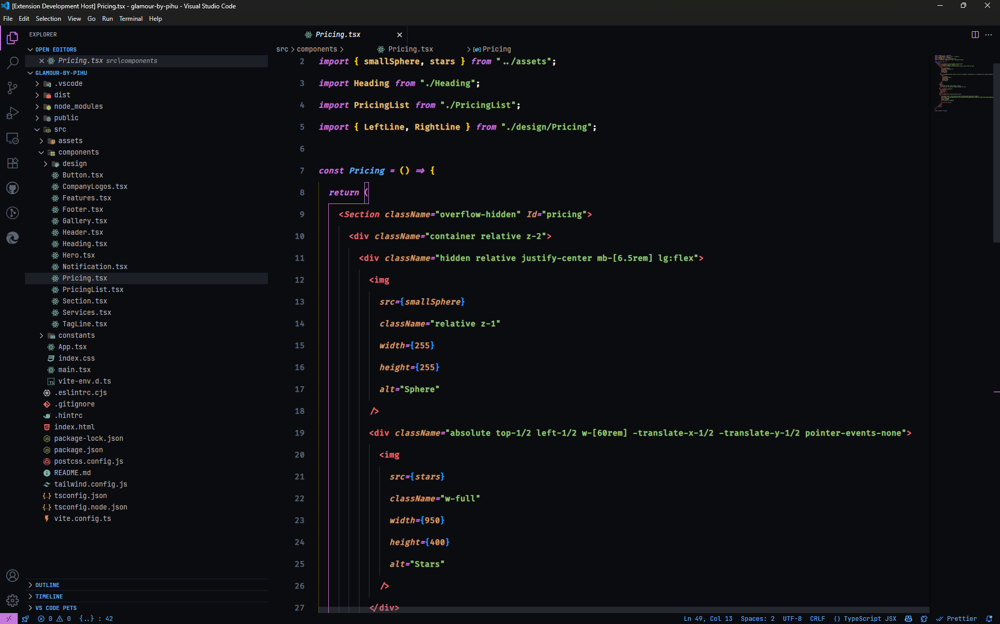
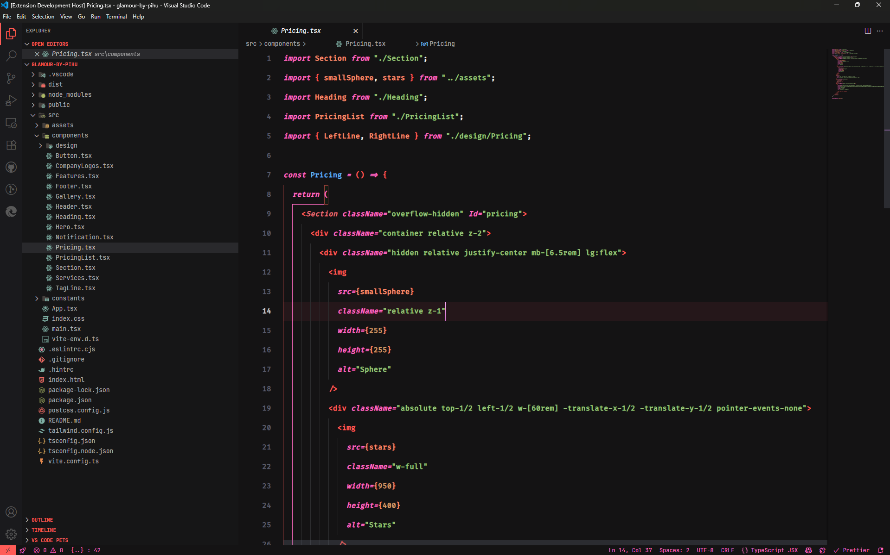
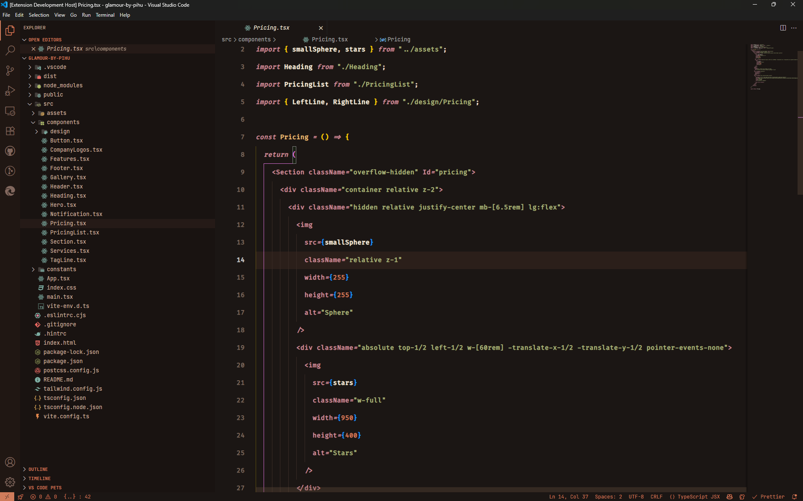
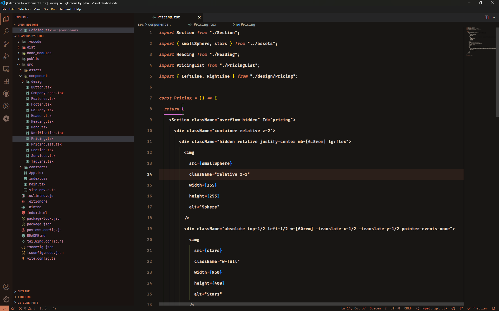

# 🕉️ Shaant Shakti – VS Code Theme Collection

A spiritually inspired **dark theme collection** for Visual Studio Code — designed to help you code with _calm intensity_, just like Lord Shiva. Whether you're deep in Zen-mode or tapping into fiery focus, there's a Shaant Shakti theme to match your energy.

> _"Calm like meditation, powerful like Tandav."_

---

## ✨ Themes Included

### 🔹 Shaant Shakti (Default)

A classic dark mode with subtle contrast, clean syntax highlighting, and soothing color balance for long coding sessions.

### 🌀 Shaant Shakti: Spirited Away Soul Drift

Inspired by mystical flows of energy and cosmic dreams. Ideal for developers who love poetic hues, and a sense of timelessness.

### ☕ Shaant Shakti: Mystic Roast

A grounded, coffee-toned theme that blends vintage warmth with monk-like minimalism. Perfect for late-night coding over chai.

### 🌪️ Shaant Shakti: Sand Storm

The desert soul — dry winds, faded trails, and rugged clarity. This theme channels raw power with organic warmth and dusty contrast.

---

## 🌈 Previews

> _Visuals vary slightly per variant._

### Shaant Shakti




### Spirited Away Soul Drift



### Mystic Roast



### Sand Storm



---

## 📦 Installation

1. Open **Extensions** panel in VS Code (`Ctrl+Shift+X`)
2. Search for **Shaant Shakti**
3. Click **Install**
4. Open command palette (`Ctrl+K Ctrl+T`) → Choose your favorite Shaant Shakti theme variant

---

## ⚙️ Recommended Settings

Enhance your Shaant Shakti experience with these tweaks:

### Suggested Fonts

- [Fira Code](https://github.com/tonsky/FiraCode)
- [JetBrains Mono](https://www.jetbrains.com/lp/mono/)
- [Cascadia Code](https://github.com/microsoft/cascadia-code)

### VS Code Settings

```json
{
  "editor.fontSize": 15,
  "editor.letterSpacing": 0.5,
  "editor.tabCompletion": "on",
  "editor.tabSize": 2,
  "editor.lineHeight": 42,
  "editor.fontWeight": "600",
  "editor.lineNumbers": "on",
  "editor.wordBreak": "normal",
  "editor.wordWrapColumn": 80,
  "editor.cursorSmoothCaretAnimation": "on",
  "editor.fontFamily": "Fira Code Retina, JetBrains Mono, Cascadia Code, Operator Mono, monospace",
  "editor.fontLigatures": true
}
```

---

## 🧘 Why Shaant Shakti?

Because we don’t just code — we **channel energy** into creation.

These themes are handcrafted to:

- ✅ Reduce eye strain with calm palettes
- ✅ Preserve syntax clarity and dev flow
- ✅ Match your coding _mood_, not just your monitor

---

## 🛠 Development & Feedback

Developed with love and **Shakti** by [Aditya Tiwari](https://github.com/Aditya-Ace).

GitHub Repo: [Shaant Shakti Themes](https://github.com/Aditya-Ace/Shaant-Shakti)
Issues or suggestions? Open a GitHub issue or drop a PR 🙏

---

## 📜 License

[MIT](LICENSE)

---

> _"When your IDE feels like a temple, your code becomes poetry."_
> – **Shaant Shakti**
