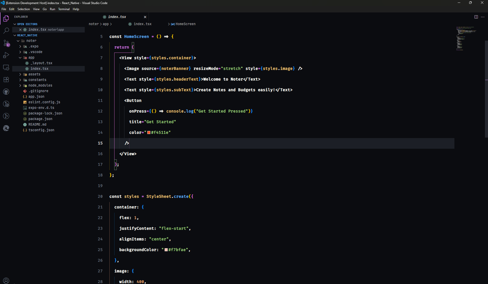
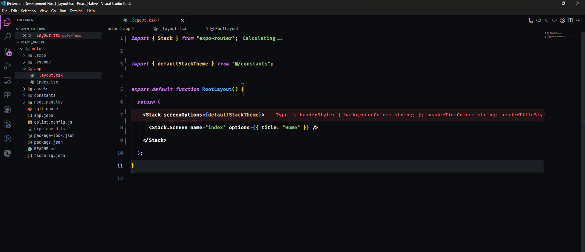

# 🕉️ Shaant Shakti – VS Code Theme

A spiritually inspired **dark theme** that balances _inner peace_ with _raw coding power_ ⚡  
**Shaant Shakti** is designed to keep you grounded, focused, and creatively fierce — just like Lord Shiva:

> _Calm like meditation, powerful like Tandav._

---

## ✨ Features

- 🌑 Deep black background for focused night sessions
- 🔮 Mystic purple keywords with italics
- 🟢 Peaceful green strings
- 🔷 Calm blue functions
- 🟠 Bold orange numbers & booleans
- 🔘 Soft grey italic comments
- 💻 Polished UI — activity bar, sidebar, tabs, status bar, scrollbars
- 🎯 Perfect for devs who love Zen-mode, midnight coding, or spiritual power

---

## 🌈 Preview





> _Coding becomes meditation..._

---

## 📦 Installation

1. Go to Extensions (`Ctrl+Shift+X`) in VS Code
2. Search for `Shaant Shakti`
3. Click **Install**
4. Press `Ctrl+K Ctrl+T` and choose **Shaant Shakti** from the theme list

---

## 🛠 Recommended Settings

```json
  "editor.fontSize": 15,
  "editor.letterSpacing": 0.5,
  "editor.tabCompletion": "on",
  "editor.tabSize": 2,
  "editor.lineHeight": 42,
  "editor.fontWeight": "600",
  "editor.lineNumbers": "on",
  "editor.wordBreak": "normal",
  "editor.wordWrapColumn": 80,
  "editor.cursorSmoothCaretAnimation": "on",
  "editor.fontFamily": "Fira Code Retina, MonoLisa, JetBrains Mono, Operator Mono Lig, JetBrains Mono NL, Consolas, Menlo, Cascadia Code, Ubuntu Mono, Source Code Pro, Fira Code, monospace",
  "editor.fontLigatures": true,
```
