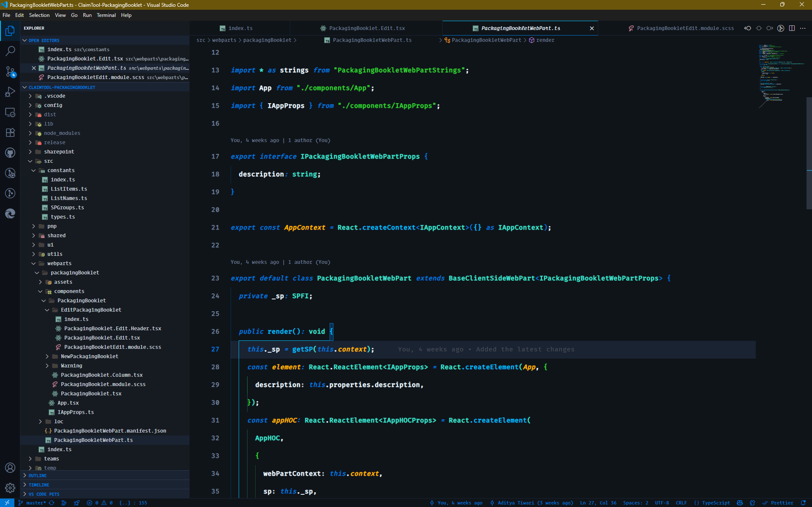
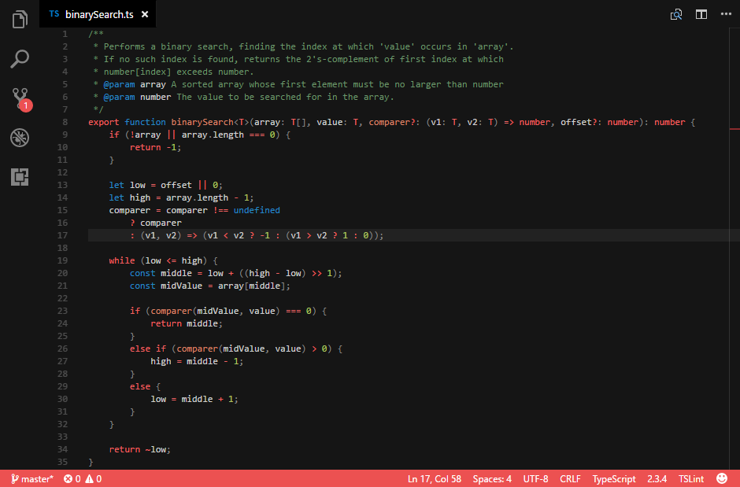

# 🕉️ Shaant Shakti – VS Code Theme Collection

A spiritually inspired **dark theme collection** for Visual Studio Code — designed to help you code with _calm intensity_, just like Lord Shiva. Whether you're deep in Zen-mode or tapping into fiery focus, there's a Shaant Shakti theme to match your energy.

> _"Calm like meditation, powerful like Tandav."_

---

## Support the Journey

If these themes bring peace to your coding sessions and spark joy in your development flow, consider supporting this spiritual coding journey! Your kindness fuels more beautiful themes and tools for the developer community.

**🙏 [Buy me a chai ☕ – PayPal Donation](https://paypal.me/adityaace777?country.x=IN&locale.x=en_GB)**

> _"When developers support developers, the whole universe codes in harmony."_ ✨*Every donation, no matter how small, creates ripples of gratitude and inspiration!* 🌊

---

## Themes Included

### Shaant Shakti (Default)

A classic dark mode with subtle contrast, clean syntax highlighting, and soothing color balance for long coding sessions.

### Shaant Shakti: Spirited Away Soul Drift

Inspired by mystical flows of energy and cosmic dreams. Ideal for developers who love poetic hues, and a sense of timelessness.

### Shaant Shakti: Mystic Roast

A grounded, coffee-toned theme that blends vintage warmth with monk-like minimalism. Perfect for late-night coding over chai.

### ️ Shaant Shakti: Sand Storm

The desert soul — dry winds, faded trails, and rugged clarity. This theme channels raw power with organic warmth and dusty contrast.

### Shaant Shakti: SPFx Sanctuary

A professional SharePoint Framework theme with Microsoft's modern design language. Perfect for enterprise developers building the future of workplace collaboration.

### Shaant Shakti: Spirited Away

Enhanced with font ligatures and elegant italics, this theme captures the magical essence of Studio Ghibli's masterpiece while maintaining coding clarity.

---

## Previews

> _Visuals vary slightly per variant._

### Shaant Shakti


### Soul Drift


### Mystic Roast


### Sand Storm


### SPFx Sanctuary



### Spirited Away




---

## Installation

1. Open **Extensions** panel in VS Code (`Ctrl+Shift+X`)
2. Search for **Shaant Shakti**
3. Click **Install**
4. Open command palette (`Ctrl+K Ctrl+T`) → Choose your favorite Shaant Shakti theme variant

---

## ️ Recommended Settings

Enhance your Shaant Shakti experience with these tweaks:

### Suggested Fonts

- [Fira Code](https://github.com/tonsky/FiraCode)
- [JetBrains Mono](https://www.jetbrains.com/lp/mono/)
- [Cascadia Code](https://github.com/microsoft/cascadia-code)

### VS Code Settings

```json
{
  "editor.fontSize": 15,

  "editor.letterSpacing": 0.5,

  "editor.tabCompletion": "on",

  "editor.tabSize": 2,

  "editor.lineHeight": 42,

  "editor.fontWeight": "600",

  "editor.lineNumbers": "on",

  "editor.wordBreak": "normal",

  "editor.wordWrapColumn": 80,

  "editor.cursorSmoothCaretAnimation": "on",

  "editor.fontFamily": "Fira Code Retina, JetBrains Mono, Cascadia Code, Operator Mono, monospace",

  "editor.fontLigatures": true
}
```

---

## Why Shaant Shakti?

Because we don't just code — we **channel energy** into creation.

These themes are handcrafted to:

- ✅ Reduce eye strain with calm palettes
- ✅ Preserve syntax clarity and dev flow
- ✅ Match your coding _mood_, not just your monitor
- ✅ Support font ligatures for beautiful code typography
- ✅ Provide semantic highlighting for modern development

---

## Show Some Love

If Shaant Shakti themes have made your coding experience more peaceful and productive, here are ways to spread the love:

- ⭐ **Star this project** on GitHub
- 📝 **Leave a review** on VS Code Marketplace
- 🐦 **Share on social media** with #ShaantShakti
- ☕ **[Support with a donation](https://paypal.me/adityaace777?country.x=IN&locale.x=en_GB)** – every contribution helps create more beautiful themes!

> _"Gratitude is the currency of the universe. When you give, you receive tenfold."_ 🌟

---

## Development & Feedback

Developed with love and **Shakti** by [Aditya Tiwari](https://github.com/Aditya-Ace).

GitHub Repo: [Shaant Shakti Themes](https://github.com/Aditya-Ace/Shaant-Shakti)

Issues or suggestions? Open a GitHub issue or drop a PR 🙏

---

## License

[MIT](LICENSE)

---

> _"When your IDE feels like a temple, your code becomes poetry."_

> _"Code with the serenity of a sage and the power of a storm."_ ⚡

> – **Shaant Shakti**

---

**🌸 Thank you for being part of this beautiful coding journey! 🌸**

_May your code compile without errors and your deployments be ever successful!_ 🚀✨
